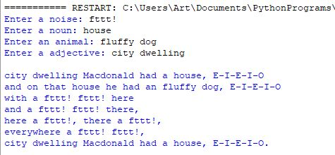

    
# Mad Libs
For this assignment we will use Python's 
You can use the following Mad Lib or make up your own:
```text
Adjective Macdonald had a Noun, E-I-E-I-O
and on that Noun he had an Animal, E-I-E-I-O
with a Noise Noise here
and a Noise Noise there,
here a Noise, there a Noise,
everywhere a Noise Noise,
Adjective Macdonald had a Noun, E-I-E-I-O.
```


*This assignment is based on an assignment at [Te@ch with ICT](https://www.teachwithict.com/mad_libs.html)*
